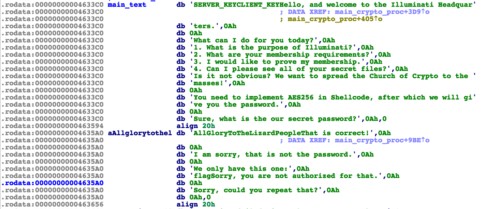
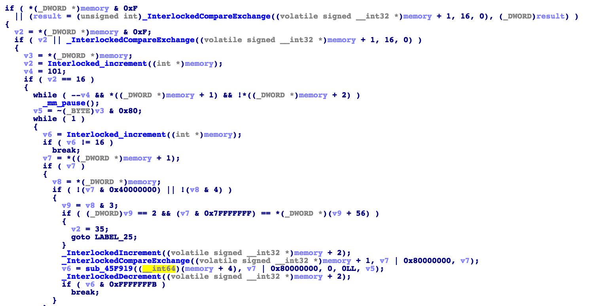
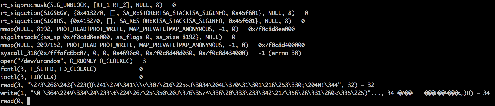
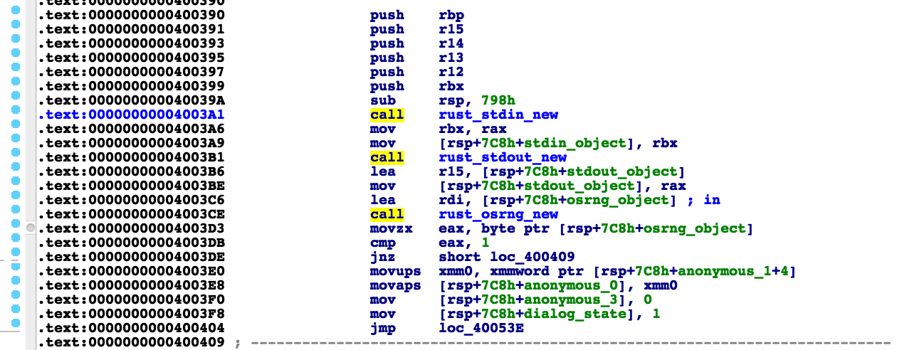
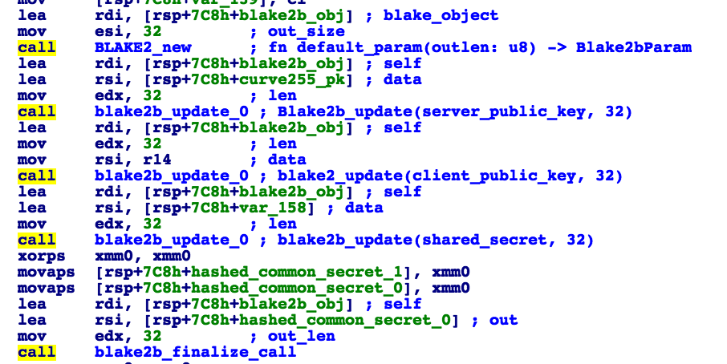
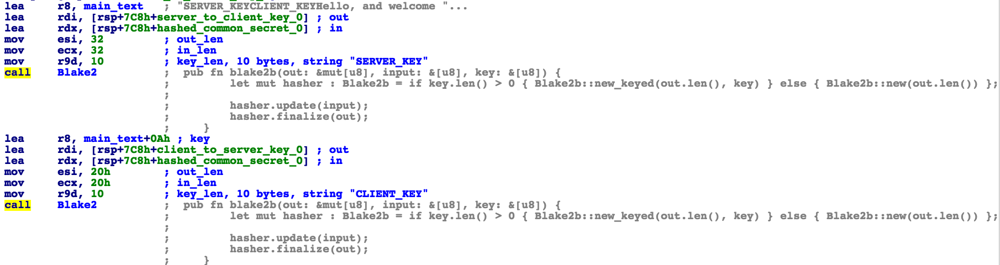

# tl;dr:
Reverse engenieer (RE) the binary written in Rust, recover the protocol, get in touch with "Illuminati Headqarters", show them a password and grab the flag. The protocol consist of two parts: a Diffie-Hellman like key exchange based on Curve25519 and Blake2b as key derivation function and message encryption using chacha20-poly1305 AEAD scheme with empty AAD and nonces stored on client and server side (the nonces aren't transmitted).

# motivation
The task was solved by only two persons, there is no write up has been published yet. This is the first time I touched Rust lang. Usually, I do some tutorials and write simpe "Hello, world!" like apps, but this time I'll look into it through IDA =)

# the challenge
You're provided with a binary file and an address of a remote server where the binary acts as a CGI application. You need to find the flag. Unfortunately, Google shut down the remote server, but the same service can easily be launched using amazing socat tool.

# preparing the environment
Generate RSA key:
```bash
$ openssl genrsa -out srv.key 2048
````
Prepare certificate for the key:
```bash
$ openssl req -new -key srv.key -x509 -days 3653 -out srv.crt
```
Merge them into one file:
```bash
$ cat srv.key srv.crt > srv.pem
```
Run your server:
```bash
$ socat OPENSSL-LISTEN:4443,bind=0.0.0.0,method=SSL23,cipher=RSA:HIGH,verify=0,cert=./keys/srv.pem,fork EXEC:./rich-man-stripped
```
During RE and client application development you can attach to the process with IDA local or remote debugger and see what's going on inside the process.

# the binary file
The file you're given is just a x64 ELF executable. 
```bash
$ file rich-man-stripped
rich-man-stripped: ELF 64-bit LSB  executable, x86-64, version 1 (SYSV), statically linked, BuildID[sha1]=ba18079f42e0cf7752010dc62a1ed4e6701f2479, stripped
```

It's statically linked without any dependencies and can be launched in any Linux based OS. It also stripped, which means we won't have any debug symbols.

In the section with resources we can see some strings near the flag:



We're going to visit "Illuminati Headquarters", there is something about passwords and implementation of AES in the shellcode. Ok, let's cope with these Illuminati tricks.

# Rust RE tips & tricks
Having spent some time on the file, I came up with the following observations that will help to RE the file:
* we can benefit from the fact that [Rust is an open source language](https://github.com/rust-lang/rust/)
* all assert calls are rendered as strings that help to identify what particular functions are used
* there is a "Cargo" repository with lots of Rust packages and ".rodata" section contains some links to them. For example, the string 
```"/root/.cargo/registry/src/github.com-88ac128001ac3a9a/rust-crypto"``` gives us a clue about [a particular package used for crypto operations](https://github.com/DaGenix/rust-crypto/).
* there are links not only to Rust packages, but also to particular files in those packages.
* in the vast majority of cases the first parameter passed to the function (via RBX register) is a memory for the object that will be created and returned by function
* sometimes the compiler treats some functions as inlines, so there won't be one-to-one match with the Rust sources and recovered functions.
* in the majority of cases a buffer object is passed to a function using two parameters - the first is memory pointer and the second is buffer length.
* Rust uses it's own memory allocation mechanism called "jemalloc". In the vast majority of cases objects are put on stack instead of heap.
* In some cases compiler generates code that looks weird. For example the following expression ``` for (d,s) in e.iter_mut().zip(n.iter()) {
      *d = *s;
} ``` was compiled to 32 pieces like 
```asm
.text:00000000004093F4                 mov     al, [rsi]
.text:00000000004093F6                 mov     byte ptr [rsp+458h+var_58], al
.text:00000000004093FD                 cmp     rdx, 1
.text:0000000000409401                 jz      loc_409649
```
It seems that either the binary was compiled without optimizations enabled (but loop was unrolled) or the compiler failed to properly optimize this piece of code.
* All functions related to IO contain substantial amount of "synchonization" code:



# RE process
Follow IDA XREF from the interesting "Illuminati" strings in ".rodata" to the code and you'll get to the main function (I called it "main_crypto_function"). On the server side the binary acts as CGI application - all its output is written to a socket and all its input comes from stdin that is bound to the same socket (see the socat configuration above). Let's run it under strace: 



Well, it opens ```/dev/urandom```, gets 32 bytes of random data, writes it into stdout and waits until some input is passed. So, let's identify the functions responsible for reading stdin, random data and writing stdout. 

## IO and RNG, Curve25519
It's easy to notice that these functions are called from the "main_crypto_function" (just get arount and pay attention at InterlockedIncrement etc. function calls). Let's take a look at Rust's [stdio sources](https://github.com/rust-lang/rust/blob/master/src/libstd/sys/unix/stdio.rs) - before using IO some objects must be created. The RNG is also accessed [via special object](https://github.com/rust-lang/rust/blob/master/src/libstd/sys/unix/rand.rs#L151). If we take a look at the start of the "main_crypto_function" we'll see the code that does exactly the same:



So, the three objects are created. Then 32 bytes on stack are zeroed using MMX instructions and filled with 32 bytes of random data. Later, this data and the second 32 byte buffer are passed to the function, that I named ```curve25519_base```. It's actually the corresponding Rust function located [here](https://github.com/DaGenix/rust-crypto/blob/master/src/curve25519.rs#L2152). The use Curve25519 is easy to identify by the following features:
* the use of 9 - base point
* the way 32 random bytes are turned into a point on the curve:
```c
e[0] &= 248;
e[31] &= 127;
e[31] |= 64;
```

And other operations that are easy to spot as the code generated by Rust compiler is close to that from the [rust-crypto package](https://github.com/DaGenix/rust-crypto). So, we identified that the two 32 byte buffers are the curve25519 public and private key. Then the public key is written to stdin - sent to the other party. 

## IO Packets
In this part I omit some details. Before being sent to other party all data is converted to a byte array and prepanded by two bytes that indicate the length of the data. It's also assumed that any data read from stdin also has the same format. First two bytes indicate the length of the payload. The length is transmitted in Big Endian format.

## Diffie-Hellman common secret
Curve25519 is used in Diffie-Hellman protocol to get the shared key. When the parties had sent each other their public keys and computed the common value, the common secret is calculated with the use of server public key, client public key, the common value and Blake2b hash function. The process is in the picture below:



The high-level formula for the shared secret is
```
shared_secret = Blake2b(server_pk || client_pk || common_value)
````
How to identify Blake2b function:
* use [magic constants](https://github.com/DaGenix/rust-crypto/blob/master/src/blake2b.rs#L13)
* use [asserts](https://github.com/DaGenix/rust-crypto/blob/master/src/blake2b.rs#L184) that are put as strings in ".rodata"

## Key Derivation function
When the common secret is obtained, two keys are generated. The first is used to encrypt server2client communication and the second - to encrypt client2server communication. The Blake2b keyed hash function is used as KDF. This process is depicted in the picture:



In the both cases the common secret is used as a key for the keyed hash function, "SERVER_KEY" and "CLIENT_KEY" strings are used as messages. The high-level formulas are:
```python
server2client_key = Blake2b(key=shared_secret, msg="SERVER_KEY")
client2server_key = Blake2b(key=shared_secret, msg="CLIENT_KEY")
```

## message encryption
Once encryption keys are derived, server sends an encrypted "Hello, and welcome to the Illuminati Headquarers..." message. All messages are encrypted with AEAD scheme [chacha20-poly1305](https://github.com/DaGenix/rust-crypto/blob/master/src/chacha20poly1305.rs) with empty AAD.

The use of chacha20-poly1305 can be identified by assert strings in ".rodata" that are unique for chacha20 and poly1305 (they are used only in these sources). The nonces aren't transmitted and stored on the client and server side. The nonce counters are independent.

# client implementation
For implementation of the client I took a basic example from [stackoverflow](http://codereview.stackexchange.com/questions/108600/complete-async-openssl-example) and added some functions. I also used libsodium for Curve25519 and Blake2b crypto primitives.

## key agreement

At first we generate 32 random bytes and turn them into a point on Curve25519 - it will be our private key:
```c
RAND_bytes((unsigned char*)client_sk, sizeof(client_sk));
client_sk[0] &= 248;
client_sk[31] &= 127;
client_sk[31] |= 64;
```
Then compute public key:
```c
crypto_scalarmult_curve25519_base(client_pk, client_sk);
```
And later we can compute shared value:
```c
crypto_scalarmult_curve25519(shared_secret, client_sk,  server_pk);
```

## key derivation function
To compute shared secret we use Blake2b function and hash public keys and the common value we got during execution of Diffie-Hellman protocol:
```c
memcpy(accumulator, server_pk, sizeof(server_pk));
memcpy(accumulator + sizeof(server_pk), client_pk, sizeof(client_pk));
memcpy(accumulator + sizeof(server_pk) + sizeof(client_pk), shared_secret, sizeof(shared_secret));

crypto_generichash_blake2b(shared_secret, sizeof(shared_secret), accumulator, sizeof(client_pk) + sizeof(server_pk) + sizeof(shared_secret), NULL, 0);
```

Then we compute session keys:
```c
const char server_key_str[] = "SERVER_KEY";
crypto_generichash_blake2b_state state1;
crypto_generichash_blake2b_init(&state1, server_key_str, 10, 32);
crypto_generichash_blake2b_update(&state1, shared_secret, 32);
crypto_generichash_blake2b_final(&state1, server_key, 32);
```

The other session key is computed in the same manner.

## message encryption
All messages are ancrypted in the following way:
```c
if(crypto_aead_chacha20poly1305_encrypt(buffer+2, &ciphertext_len, message, strlen(message), NULL, 0, NULL, nonce_out, client_key) == 0)
{
    nonce_out[0] += 1;
    buffer[0] = (ciphertext_len >> 8) & 0xff;
    buffer[1] = ciphertext_len & 0xff;

    to_write = ciphertext_len + 2;
    currentStatus = MESSAGE_IS_BEING_WRITTEN;
}
```

As it was mentioned before - chacha20poly1305 is used and AAD is NULL.

# talking to "Illuminati"
On running the client we get the following message:
```
Hello, and welcome to the Illuminati Headquarters.

What can I do for you today?
1. What is the purpose of Illuminati?
2. What are your membership requirements?
3. I would like to prove my membership.
4. Can I please see all of your secret files?
```

If you chose 1, then you'll get:
```
Is it not obvious? We want to spread the Church of Crypto to the masses!
```
Yeah, that's great! If you chose 2, you'll get:
```
You need to implement AES256 in Shellcode, after which we will give you the password.
```
The flag is in point 3 and 4. At first you need to enter the password hardcoded in the binary ("AllGloryToTheLizardPeople" without quotes), and then go to 4 and you'll get the flag.

# the end 
That's it. It's not hard to do if you're familiar with Rust.
The complete sources of the client can be found at the repository.

